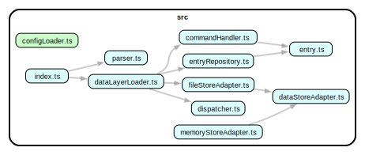

# 🧰 EXEC: project-oriented task and attention management

## philosophy

- UX designed to minimise friction for power users
- Maximise expressive power through careful choice and combination of simple
components
- Be fast.
- Be simple.
- Everything is an entry
- Nondestructive / event-oriented data
- Plugin system: users can extend with JS / TS; user definitions are as powerful as built ins
- Aggressive separation of concerns. CLI, TUI, web front ends. 
- Aspirational: Support for multiple datastore adapters.
  - Local JSON file storage: 
    - advantages
      - easy cross-device sync / interop
      - easy git backup
      + flexibility / power of plugin architecture
    - disadvantages
      - performance may be problematic
      - algorithmic complexity pushed into application code
        - validation, retrieval, conversion
        - filtering and object hydration
        - tree stuctures
  - SQLite 
    - advantages
      + performance(!)
      + portability
      + application complexity
      + WAL support somewhat mitigates backup / sync
    - disadvantages
      - no JSON support in Prisma
      - file sync problematic
      - no multiplayer
  - Postgres
    - advantages
      + it's Postgres
      + performance, features & stability
      + JSON support in Prisma
      + cloud deployment
    - disadvantages
      - portability
      - installation complexity
      - interop with file-based sync
  - Prisma
    - advantages
      + design sucks less than ActiveRecord (the lib & pattern)
      + nice provider of validation & safety
      + Supports Postgres
      + Supports mySQL
        - but not JSON columns
    - disadvantages
      - may not (natively) support recursive structures
      - no JSON support for sqlite
  - MongoDB
    - advantages
      - Prisma support
      - domain appropriate
      - JSON support; document storage
    - disadvantages
      - it's MongoDB
      - poor backup / interop / sync story
      - research required
      

# TODO

filters
  tags
    groups -> tag[]

command -> interactive? -> confirmation(command)

## Diagrams

